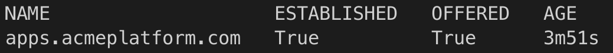
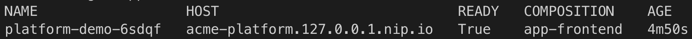
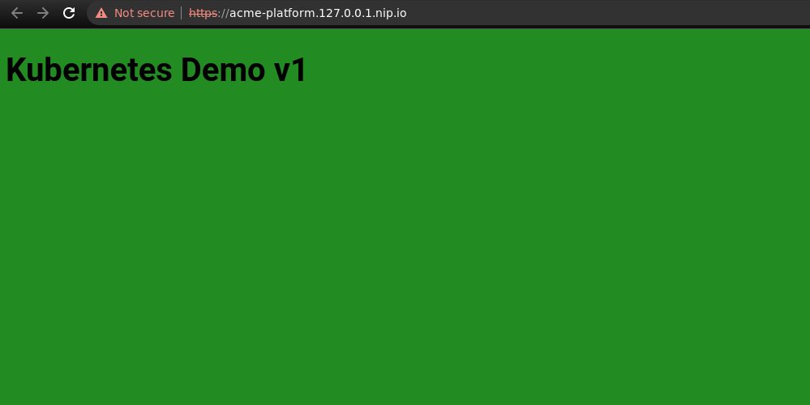
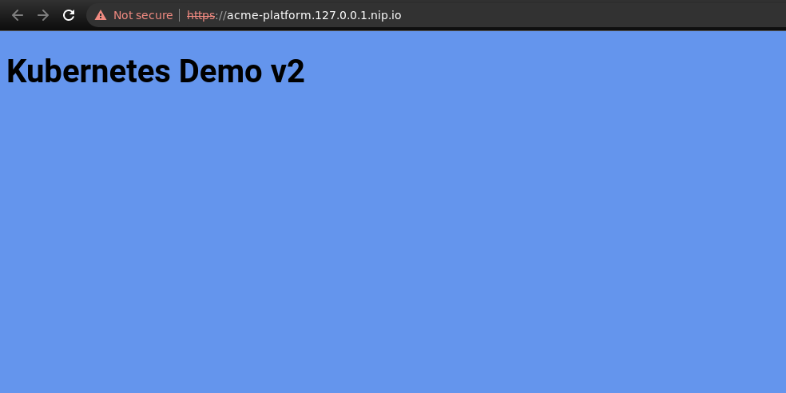

### Compose Kubernetes Applications

By utilizing Kubernetes provider, it's possible to control what Kubernetes resources are being created. It also enables complexity hiding for developers not familiar with [Kubernetes Resource Model](https://github.com/kubernetes/design-proposals-archive/blob/main/architecture/resource-management.md). In this scenario we will deploy a Kubernetes application consisting of:

- deployment
- service
- ingress
- horizontal pod autoscaler

Instead of exposing the resources directly to developers who might be inexperience with Kubernetes, we will create a simple composition containing only important fields, such as:

- namespace to deploy to
- image with tag
- name of the host for ingress

#### Scenario Steps

- create a kind cluster with nginx ingress controller setup `make`
  > if you have other local clusters with ingress controller running, make sure to stop them so there is no ports collision.
  > Notice that this cluster does not provision aws provider, only local Kubernetes provider.
- cd into <kbd>k8s-applications</kbd> directory
- apply composition and definition `kubectl apply -f composition-definition.yaml`
  
  
- create a namespace for the resources `kubectl create ns devops-team`
- claim the resources by running `kubectl apply -f app-claim.yaml`
- navigate to `https://acme-platform.127.0.0.1.nip.io/` and you should see a simple demo page
  

#### Modify Resources

We are going to modify existing claim by changing the image

- change the image to `piotrzan/nginx-demo:blue`
- modify the resources by running `kubectl apply -f app-claim-blue.yaml` and after a while the background should change to blue
  
- delete claim `kubectl delete -f app-claim.yaml`
- switch to the root directory and cleanup the cluster `make cleanup`
