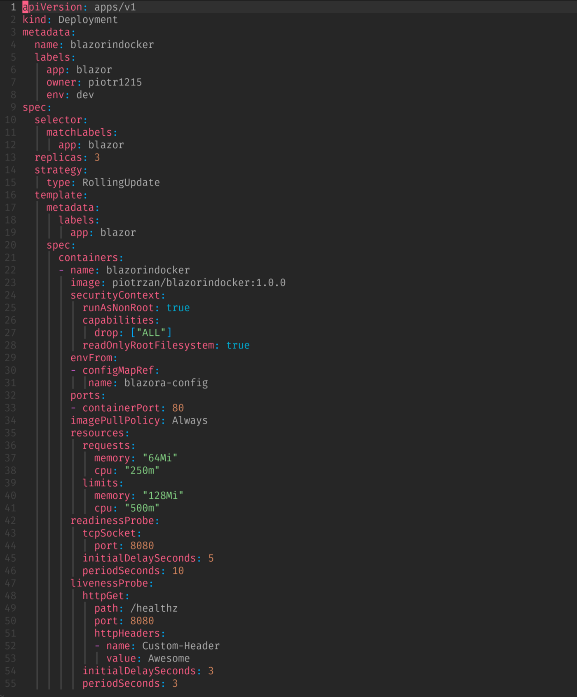
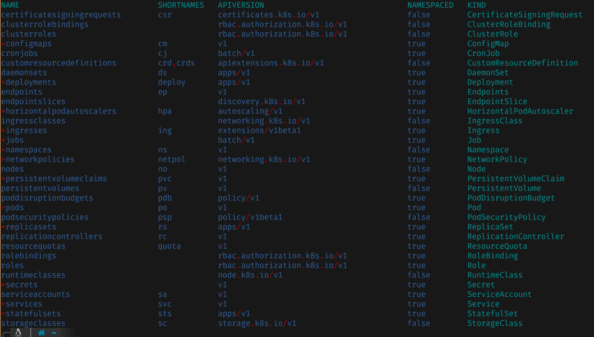

# Introduction to Crossplane

This workshop will help you understand Crossplane architecture and use cases.

- Understand how Crossplane solves infrastructure provisioning and configuration
- Learn about and see basic building blocks in action
- Go through real world scenarios of creating, consuming and managing internal platform

TODO: Insert video of the Katacoda walktrhough

TODO: Insert link to Katacoda scenario

## Tool of Choice

> For a more overview of Crossplane, check out this [short presentation](https://slides.com/decoder/crossplane) and very comprehensive [Crossplane Docs](https://crossplane.io/docs/v1.6/).

Below diagram explains Crossplane's components and their relations.

<details>
    <summary>Click here to see Crossplane architecture diagram</summary>


</details>

> At the end of this tutorial you will able to create a free account in [Upbound Cloud](https://www.upbound.io/) and try provisioning cloud infrastructure youself!

What makes Crossplane so special? First, it builds on Kubernetes and capitalizes on the fact that the real power of Kubernetes is its powerful API model and control plane logic (control loops). It also moves away from Infrastructure as Code to Infrastructure as Data. The difference is that IaC means writing code to describe how the provisioning should happen, whereas IaD means writing pure data files (in the case of Kubernetes YAML) and submitting them to the control component (in the case of Kubernetes an operator) to encapsulate and execute the provisioning logic.

The best part about Crossplane is that it seamlessly enables collaboration between Application Teams and Platform Teams, by leveraging [Kubernetes Control](https://containerjournal.com/kubeconcnc/kubernetes-true-superpower-is-its-control-plane/) Plane as the convergence point where everyone meets.

## Kubernetes Simplified

Production grade Kubernetes resources are often complex chunks of YAML with settings related to security, performance, hardware utilization, observability and the list goes on. Below you can see an example of a deployment with hardened security settings and other best practices.



And this is just a single deployment resource, there are many more to worry about. Typically, a containerized app running on Kubernetes will require

- deployment
- service
- service account
- roles and cluster roles
- role bindings
- secret
- config map
- network policies
- HPA (horizontal pod autoscaler)

And those are only stateless workflows, for stateful workloads, very often

- volumes
- persistant volume claim
- storage class configuraiton
- stateful sets

And because Kubernetes almost never funcions in isolation, you will need to inclulde multiple CRDs (custom resource definitions) that come along with additonal products like service meshes, observability tech, security scanners and many many more.

Here is a list of Kubernetes resources commonly used to describe workloads. The items marked with * are the ones where developers typally have to interact with.



Now imagine that those resources will need to be multiplied by the number of applications/teams/environments and each is likely to have a slight variation to account for differences in the team governance, tech stack, changes velocity etc.

There are 2 common approaches to solving this problem.

1. Make a handover point bewteen Dev and Ops be a container image. In this scenario developers don't have any influence on how resoiurces are put together and what configuraiton is used. On the other hand Ops do not have development and application know how and context to properly address development concerts. Result? Silos with increasingly complicated and convoluted handoff procedures, no clear separation of concerns, leading to development slowing down and new features being released less frequent.
2. Shift left without support. Developers are left to theri own devices and prioritize application develooment concerns over operational concenrs.

Correct way TODO

By utilizing [Kubernetes provider](https://github.com/crossplane-contrib/provider-kubernetes), it's possible to control what Kubernetes resources are being created. It also enables complexity hiding for developers not familiar with [Kubernetes Resource Model](https://github.com/Kubernetes/design-proposals-archive/blob/main/architecture/resource-management.md). In this scenario we will deploy a Kubernetes application consisting of:

- deployment
- service
- horizontal pod autoscaler

Instead of exposing the resources directly to developers who might be inexperience with Kubernetes, we will create a simple composition containing only important fields, such as:

- namespace to deploy to
- image with tag

First we need to let Crossplane know that we would like to define a composite resource (XR), by creating a composite resource definition (XRD) `kubectl apply -f definition.yaml`. Next let's create a sample composition to let Crossplane know what resources should be created `kubectl apply -f composition.yaml`.

> Definition describes API for creating a composite resource whereas composition defines what managed resources will be created when composite resource is created either directly or by a dedicated claim.

Here are the resources created in our cluster. `kubectl get xrd` shows our composite resource definition whereas `kubectl get compositions` returns all available compositions. Give it a try.

We need to create a namespace for the resources `kubectl create ns devops-team` first.

Our composition and definition describes what Kubernetes objects we want to create, but how should developers let us know what should be created? Do they need to open a Jira ticket? 😤... Nah, they just need to create a simple claim, like so

```yaml
apiVersion: acmeplatform.com/v1alpha1
kind: AppClaim
metadata:
  name: platform-demo
  labels:
    app-owner: piotrzan
spec:
  id: acmeplatform
  compositionSelector:
    matchLabels:
      type: frontend
  parameters:
    namespace: devops-team
    image: piotrzan/nginx-demo:green
```

By applying the claim, we are creating multiple Kubernetes resources "under the hood" without needing to know what they are and how they are created. This concern can be moved onto a Platform Team.

`kubectl apply -f app-claim.yaml`

`kubectl wait deployment.apps/acmeplatform --namespace devops-team --for condition=AVAILABLE=True --timeout 1m`

There are several resources created based on the composition `kubectl get managed`. One of them is a deployment with a sample web app, let's port forward to it.

`kubectl port-forward deployment/acmeplatform -n devops-team --address 0.0.0.0  8080:80`

You can also [open the web page right here](https://[[HOST_SUBDOMAIN]]-8080-[[KATACODA_HOST]].environments.katacoda.com/)

In the next section, we will see how easy it is to modify the claim ➡

We can easily update the image

`kubectl apply -f app-claim-blue.yaml`{{execute interrupt}}

> Notice how the page changed background color to blue with just one line change

`kubectl port-forward deployment/acmeplatform -n devops-team --address 0.0.0.0  8080:80`

> You can [open the web page right here again](https://[[HOST_SUBDOMAIN]]-8080-[[KATACODA_HOST]].environments.katacoda.com/)

Deleting the application and underlying resources is as simple as `kubectl delete -f app-claim.yaml`{{execute interrupt}}
You observe how all the resources created by the claim got deleted as well

The similicity was possible thanks to Crossplane's composition mechanism which we will explore later.

## The Power of Composition

The magic of crossplane really happens in the [composition](https://crossplane.io/docs/v1.6/reference/composition.html). There are 3 main tasks that composition performs

- compose together set of managed resources based on a claim or composed resource
- reference credentials needed for accessing the provider API
- patch/map from values provided in a claim to values in managed resource

Below you can see how composition creates deployment, service and horizontal pod autoscaler in response to creating the AppClaim. The "binding glue" between the composition and actual Kubernetes resource is a composite resource definition (XRD) which you can think of as a kind of API between the developer consuming resources via claim and platform engineer or SRE desgning the composition for underlying resources or infrastructure.

Here are 2 key fields that make the composition so powerful.

### forProvider

Specifies kubernetes resources and settings to be created. In this case we can see how the composition adds livenessProbe and readinessProbe as well as resource limits which might be defined by the Platform Team and thus not exposed to Application Development Teams.

### Patches

Enables mapping between fields provided in the definition (XRD) and fields in the Managed Resource (MR).

> The blow YAMl is abbreviated and the complexity of those files can be substantial. This is by design, there is no magic "remove complexity" button. Instead Crossplane provides facilities for moving the complexity onto the Platfrom Teams and designing simple, custom APIs for other teams.

```yaml
apiVersion: apiextensions.crossplane.io/v1
kind: Composition
...
spec:
  compositeTypeRef:
    apiVersion: acmeplatform.com/v1alpha1
    kind: App
...
  - name: deployment
    base:
      apiVersion: kubernetes.crossplane.io/v1alpha1
      kind: Object
      spec:
        forProvider:
          manifest:
            apiVersion: apps/v1
            kind: Deployment
            spec:
              template:
                spec:
                  containers:
                  - name: frontend
                    ports:
                    - containerPort: 80
                    livenessProbe:
                      httpGet:
                        path: /
                        port: 80
                    readinessProbe:
                      httpGet:
                        path: /
                        port: 80
                    resources:
                      limits:
                        cpu: 250m
                        memory: 256Mi
                      requests:
                        cpu: 125m
                        memory: 128Mi
    patches:
    - fromFieldPath: spec.id
      toFieldPath: metadata.name
      transforms:
        - type: string
          string:
            fmt: "%s-deployment"
...
  - name: service
    base:
      apiVersion: kubernetes.crossplane.io/v1alpha1
      kind: Object
      spec:
        forProvider:
          manifest:
            apiVersion: v1
            kind: Service
            spec:
              type: ClusterIP
              ports:
              - port: 80
                targetPort: 80
                protocol: TCP
                name: http
    patches:
    - fromFieldPath: spec.id
      toFieldPath: metadata.name
      transforms:
        - type: string
          string:
            fmt: "%s-service"
...
  - name: hpa
    base:
      apiVersion: kubernetes.crossplane.io/v1alpha1
      kind: Object
      spec:
        forProvider:
          manifest:
            apiVersion: autoscaling/v1
            kind: HorizontalPodAutoscaler
            spec:
              minReplicas: 2
              maxReplicas: 6
              scaleTargetRef:
                apiVersion: apps/v1
                kind: Deployment
              targetCPUUtilizationPercentage: 80
    patches:
    - fromFieldPath: spec.id
      toFieldPath: metadata.name
      transforms:
        - type: string
          string:
            fmt: "%s-ingress"
    readinessChecks:
      - type: None
```

## Key Takeways

The power of Crossplane is the ability to compose infrastructure including adjacent services and even applications and expose simple interafce to the consumer while gracefuly handling the complexity behind the scenes.

- Composable Infrastructure
- Self-Service
- Increased Automation
- Standardized collaboration
- Ubiquitous language (K8s API)

## Try it yourself

Now that you have learned and experimented with basic Crossplane concepts, head over to [Upbound Cloud](https://www.upbound.io/) where you can create a free account and experiment with provisioning cloud infrastructure yourself!

## Additional Resources

- [helm provider](https://github.com/crossplane-contrib/provider-helm)
- browse [Upbound Registry](https://cloud.upbound.io/browse) where you can discover and try out new providers and advanced compositions
- if you are familiar with terraform, you will [Crossplane vs Terraform](https://blog.crossplane.io/crossplane-vs-terraform/) comparison by Nic Cope very useful
- find out what is the [True Kubernetes Superpower](https://containerjournal.com/kubeconcnc/kubernetes-true-superpower-is-its-control-plane/)
- check out why I believe that Crossplane is [The Next Big Shift](https://itnext.io/infrastructure-as-code-the-next-big-shift-is-here-9215f0bda7ce) in IaC

## Open Community

If you have any questions regarding Crossplane, join the [slack channel](https://slack.crossplane.io/) and say 👋

By utilizing Kubernetes provider, it's possible to control what Kubernetes resources are being created. It also enables complexity hiding for developers not familiar with [Kubernetes Resource Model](https://github.com/kubernetes/design-proposals-archive/blob/main/architecture/resource-management.md). In this scenario we will deploy a Kubernetes application consisting of:

- deployment
- service
- ingress
- horizontal pod autoscaler

Instead of exposing the resources directly to developers who might be inexperience with Kubernetes, we will create a simple composition containing only important fields, such as:

- namespace to deploy to
- image with tag
- name of the host for ingress

